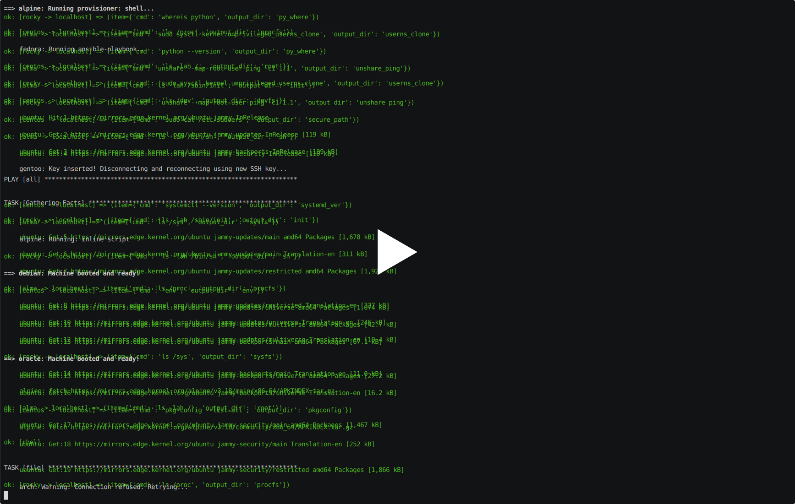

.. contents::

Distro Differences
##################

Introduction
============

Linux distributions provide users with a wide array of options when choosing an
operating system. Users typically anticipate that software designed for Linux
should operate seamlessly across various distributions. Nonetheless, the
responsibility falls on developers to ensure their applications are compatible
with all the different distros. This book aims to establish a foundation that
assists software engineers in creating more versatile programs. It does so by
highlighting some of the key differences among Linux distributions that are
significant for software development, as well as explaining how these
diversities are first built into the distributions themselves.

In the Reproduction chapter, you will find guides on how you can also generate
these distro differences for your own analysis.

Under the Distros section, you will find how these linux distributions are
built from the ground up, which is where the divergence happens.

Under the Main Differences section, you will find some of the main differences
between Linux distros, and how they may impact a software's portability.

This book hopes to be useful for all software engineers, sysadmins, and
security researchers. This book, code used throughout, and results are all
available on `Github <https://github.com/ezrizhu/cs497>`_ under the MIT
License.

This document was created by `Ezri Zhu <https://ezrizhu.com>`> as the final
project for CS 497 Independent Study at the Stevens Institute of Technology,
advised by Professor `Michael Greenberg
<https://www.stevens.edu/profile/mgreenbe>`_.

Testing Infrastructure
======================

We can reproduce our experiments with Vagrant and Ansible. Vagrant is
responsible for spinning up the VMs that we want, and Ansible is to run the
experiments on these machines.

Ansible will read from the inventory file generated by Vagrant.

Currently, the Vagrant file is configured to use the `libvirt provider
<https://vagrant-libvirt.github.io/vagrant-libvirt>`_. However, you can also
use the VirtualBox provider that's provided by Vagrant by default.

First, please ensure Ansible, Vagrant, and the Vagrant Provider that you're
using is installed and setup.

Second, clone the repository ``git clone https://github.com/ezrizhu/cs497.git``
and then delete the output directory ``out`` from the cloned repo.

To spin up the Vagrant environment and run the ansible playbook, simply run
``sudo vagrant up``.

You can also easily modify the array of distros that you want to test on by
editing the ``Vagrantfile`` in the repository.

Here is what it looks like.

`Vagrantfile <https://github.com/ezrizhu/cs497/blob/main/Vagrantfile>`_
::

      config.vm.define "arch" do |arch|
        arch.vm.box = "archlinux/archlinux"
        arch.vm.provision "shell", inline: "sudo pacman --noconfirm --needed -Syy python pkg-config"
        config.vm.synced_folder '.', '/vagrant', disabled: true
      end
    
      config.vm.define "alma" do |alma|
        alma.vm.box = "generic/alma9"
        config.vm.synced_folder '.', '/vagrant', disabled: true
      end

      config.vm.provision "ansible", after: :all do |ansible|
        ansible.playbook = "playbook.yml"
      end

For distros that may require some setup commands to be run, we're using the
shell provisioner. The ansible provisioner will be run after that.

After Vagrant spins up all the VMs and run the shell provisioner if specified,
it will run the ansible playbook.

Here's what that looks like.

`playbook.yml <https://github.com/ezrizhu/cs497/blob/main/playbook.yml>`_
::

    - hosts: all
      vars:
        commands:
          - cmd: uname -a
            output_dir: uname
          - cmd: ldd --version
            output_dir: ldd
          - cmd: whereis python
            output_dir: py_where
          - cmd: python --version
            output_dir: py_where
          - cmd: sudo sysctl kernel.unprivileged_userns_clone
            output_dir: userns_clone
          - cmd: unshare --map-root-user ping -c1 1.1
            output_dir: unshare_ping
          - cmd: ls -lah /sbin/init
            output_dir: init

You can also modify the array of tests that you want to run by editing the
file.

After that is complete, the outputs of all of our experiments will be under
``out/``.

When you are done running the experiments, run ``vagrant destroy -f`` to remove
all the VMs Vagrant created.

A terminal recording of the vagrant execution is available.

`Clickable Link <https://asciinema.org/a/659739>`_

I also developed test scripts for some of the below differences to help extract
the relevant data. They can be found under ``tests/``, and will read the data
from ``out/`` generated by the last steps.

Linux Distributions
###################

By default, our Vagrant covers some of the popular Linux distributions.

RHEL (Red Hat Enterprise Linux) is one of the most popular Linux distribution
developed by Red Hat. CentOS was one of the most common, free Linux distro
until it was discontinued by Red Hat. Rocky Linux emerged to become it's
community maintained successor. Fedora is also a community maintained desktop
orientated rhel derivative. Oracle and Alma linux are both also rhel
derivatives.

Debian is another one of the most popular Linux distributions, it is community
maintained, with Ubuntu being one of the very popular corporate supported
derivative. 

Alpine Linux is another community maintained Linux distribution that is focused
on simplicity. It uses a busybox instead of coreutils, and musl libc instead of
glibc. It is very popular in container runtimes as it is very light weight.

Lastly, Arch and Gentoo are both power user focused Linux distributions that
offers an incredible amount of user customization. They are both quite
different as well.

``./tests/uname.sh``

+--------+-----------+-------------------------------------------------------+
| Distro | OS        | uname                                                 |
+========+===========+=======================================================+
| RHEL   | GNU/Linux | 5.14.0-362.8.1.el9_3.x86_64 #1 SMP PREEMPT_DYNAMIC    |
+--------+-----------+-------------------------------------------------------+
| CentOS | GNU/Linux | 3.10.0-1160.105.1.el7.x86_64 #1 SMP                   |
+--------+-----------+-------------------------------------------------------+
| Rocky  | GNU/Linux | 5.14.0-362.13.1.el9_3.x86_64 #1 SMP PREEMPT_DYNAMIC   |
+--------+-----------+-------------------------------------------------------+
| Fedora | GNU/Linux | 6.6.8-100.fc38.x86_64 #1 SMP PREEMPT_DYNAMIC          |
+--------+-----------+-------------------------------------------------------+
| Alma   | GNU/Linux | 5.14.0-362.13.1.el9_3.x86_64 #1 SMP PREEMPT_DYNAMIC   |
+--------+-----------+-------------------------------------------------------+
| Oracle | GNU/Linux | 3.10.0-1160.105.1.0.1.el7.x86_64 #1 SMP               |
+--------+-----------+-------------------------------------------------------+
| Debian | GNU/Linux | 6.1.0-17-amd64 #1 SMP PREEMPT_DYNAMIC Debian 6.1.69-1 |
+--------+-----------+-------------------------------------------------------+
| Ubuntu | GNU/Linux | 5.15.0-91-generic #101-Ubuntu SMP                     |
+--------+-----------+-------------------------------------------------------+
| Alpine | Linux     | 6.1.70-0-virt #1-Alpine SMP PREEMPT_DYNAMIC           |
+--------+-----------+-------------------------------------------------------+
| Arch   | GNU/Linux | 6.8.8-arch1-1 #1 SMP PREEMPT_DYNAMIC                  |
+--------+-----------+-------------------------------------------------------+
| Gentoo | GNU/Linux | 6.1.69-gentoo-dist #1 SMP PREEMPT_DYNAMIC             |
+--------+-----------+-------------------------------------------------------+

Debian
======

Debian is installed via `debootstrap(debian)
<https://wiki.debian.org/Debootstrap>`_ `source
<https://salsa.debian.org/installer-team/debootstrap>`_.

A good amount of modifications to the kernel by the Debian team can be found in
their `linux repo
<https://salsa.debian.org/kernel-team/linux/-/tree/master/debian/patches/debian>`_

Their changes for other packages that Debian ships with can be found also in
`the debian gitlab <https://salsa.debian.org/debian/>`_. Such as `procps
<https://salsa.debian.org/debian/procps>`_.

Ubuntu
======

Ubuntu is also installed via `debootstrap(ubuntu)
<https://bugs.launchpad.net/ubuntu/+source/debootstrap>`_.

All of the source code for Ubuntu, as well as all the OS divergences from
Debian and the mainline kernel, can be found on their `git server
<https://bugs.launchpad.net/ubuntu/+source/linux>`_

For example, the `vm_max_map_count <vmmaxmap.md>`_ issue was patched in
Ubuntu's `procps package <https://bugs.launchpad.net/ubuntu/+source/procps>`_

Their fork of the Linux kernel can also be found `here
<https://bugs.launchpad.net/ubuntu/+source/linux>`_.

Alpine
======

Alpine's differences can be easily spotted because their build process is very
simple. Their repository for packages build scripts also has the script to
build the base system.

The `base layouts directory
<https://gitlab.alpinelinux.org/alpine/aports/-/tree/master/main/alpine-baselayout>`_.

The `base layout build file
<https://gitlab.alpinelinux.org/alpine/aports/-/blob/master/main/alpine-baselayout/APKBUILD>`_.

Arch
====

Since Arch Linux is mostly less opinionated in terms of defaults, the only
places where you can find where differences are built in on the distro levels
is the installer.

`Arch Linux Github <https://github.com/archlinux>`_
`Kernel Repo <https://github.com/archlinux/linux>`_
`Installer Repo <https://github.com/archlinux/archinstall>`_

Rocky
=====

Rocky Linux is a community fork of CentOS after RedHat made it into stream only.

It's build process is similar to the rest of the RHEL derivatives. You can find
the base package that builds the OS on their Gitlab. Which includes the default
packages, sysctl.conf config, os-release file, etc...

`rocky-release <https://git.rockylinux.org/staging/rpms/rocky-release/-/blob/r10s/SOURCES>`_

Fedora
======

Fedora follows a similar install structure as the rest of the RHEL derivatives.
You can find the fedora-release package on `the fedora
gitlab <https://src.fedoraproject.org/rpms/fedora-release/tree/rawhide>`_

Gentoo
======

The Gentoo base image comes from the `stage3 tarball
<https://wiki.gentoo.org/wiki/Stage_file>`_. Which is built with `Catalyst
<https://wiki.gentoo.org/wiki/Catalyst>`_ using `spec files
<https://wiki.gentoo.org/wiki/Catalyst#Specs_files>`_.

They're all highly customizable and different. You can find the spec files in
the `catalyst repo <https://gitweb.gentoo.org/proj/catalyst.git/>`_

That said, if your user uses Gentoo, they are hopefully competent enough to
make their own patch to your software.

Main Differences
################

libc
====

Most of the time we assume it would be fine if we are just compiling against
glibc, however, in some cases, especially ones that runs your application in a
alpine docker container, it may need to be compiled to musl libc.

There may also be other small tweaks that the upstream makes to glibc. i.e.,
`Debain glibc patches
<https://salsa.debian.org/glibc-team/glibc/-/tree/sid/debian/patches>`_ `Gentoo
glibc patchset <https://github.com/gentoo/glibc-patches/tree/master>`_

``./tests/ldd.sh``

+--------+--------------+---------+-----------------------+
| Distro | Vendor       | Version | Extra                 |
+========+==============+=========+=======================+
| RHEL   | GNU libc     | 2.34    |                       |
+--------+--------------+---------+-----------------------+
| CentOS | GNU libc     | 2.17    |                       |
+--------+--------------+---------+-----------------------+
| Rocky  | GNU libc     | 2.34    |                       |
+--------+--------------+---------+-----------------------+
| Fedora | GNU libc     | 2.37    |                       |
+--------+--------------+---------+-----------------------+
| Alma   | GNU libc     | 2.24    |                       |
+--------+--------------+---------+-----------------------+
| Oracle | GNU libc     | 2.17    |                       |
+--------+--------------+---------+-----------------------+
| Debian | Debian libc  | 2.36    | 2.36-9+deb12u3        |
+--------+--------------+---------+-----------------------+
| Ubuntu | Ubuntu GLIBC | 2.35    | 2.35-0ubuntu3.5       |
+--------+--------------+---------+-----------------------+
| Alpine | musl         | 1.2.4   |                       |
+--------+--------------+---------+-----------------------+
| Arch   | GNU libc     | 2.39    |                       |
+--------+--------------+---------+-----------------------+
| Gentoo | Gentoo glibc | 2.37    | 2.37-r7 (patchset 10) |
+--------+--------------+---------+-----------------------+

init
====

Systemd is a very common init system, however, for alpine, gentoo, and some
other obscure distros, you may need to supply another form of service file.
Such as a less declarative format i.e., a script.

``./tests/init.sh``

+--------+----------+
| Distro | Init     |
+========+==========+
| RHEL   | systemd  |
+--------+----------+
| CentOS | systemd  |
+--------+----------+
| Rocky  | systemd  |
+--------+----------+
| Fedora | systemd  |
+--------+----------+
| Alma   | systemd  |
+--------+----------+
| Oracle | systemd  |
+--------+----------+
| Debian | systemd  |
+--------+----------+
| Ubuntu | systemd  |
+--------+----------+
| Alpine | busybox  |
+--------+----------+
| Arch   | systemd  |
+--------+----------+
| Gentoo | init     |
+--------+----------+

pkgconfig
=========

``pkgconfig --list-all`` lists all the pre-installed libraries.

RHEL, Rocky, and Alma all contain the same below set.

TODO: Finish this

bash-completion dracut form formw libcrypt libcrypto libelf libssl libxcrypt
libzstd menu menuw ncurses++ ncurses ncurses++w ncursesw openssl panel panelw
systemd tic tinfo udev zlib

Arch and Gentoo comes with the largest sit due to the nature of compiling
software on their distro, specifically Gentoo.

And most of the rest of the distros comes with very similar sets of libraries,
such as openssl, udev, systemd, ncurses, panel, etc...

systemd
=======

Systemd, being the most popular init system for Linux distros, can also be
running different versions and compile flags.

TODO: Finish this

Notably, only Arch is compiled without sysvinit support.

Environments and other shell behaviors
======================================

Your environments come from your shell.
First, let's look into what your default shell is.

``./tests/default_shell.sh``

+--------+---------------+
| Distro | Default Shell |
+========+===============+
| RHEL   | /bin/bash     |
+--------+---------------+
| CentOS | /bin/bash     |
+--------+---------------+
| Rocky  | /bin/bash     |
+--------+---------------+
| Fedora | /bin/bash     |
+--------+---------------+
| Alma   | /bin/bash     |
+--------+---------------+
| Oracle | /bin/bash     |
+--------+---------------+
| Debian | /bin/bash     |
+--------+---------------+
| Ubuntu | /bin/bash     |
+--------+---------------+
| Alpine | /bin/bash     |
+--------+---------------+
| Arch   | /usr/bin/bash |
+--------+---------------+
| Gentoo | /bin/bash     |
+--------+---------------+

It appears that they're all bash, which makes our lives easier.

TODO: Finish this

To quote from the `bash manpage <https://linux.die.net/man/1/bash>`_

    When bash is invoked as an interactive login shell, or as a non-interactive
    shell with the --login option, it first reads and executes commands from the
    file /etc/profile, if that file exists. After reading that file, it looks for
    ~/.bash_profile, ~/.bash_login, and ~/.profile, in that order, and reads and
    executes commands from the first one that exists and is readable. The
    --noprofile option may be used when the shell is started to inhibit this
    behavior.

You can use your favorite diff tool to inspect the differences in all of these
files from the out directory. Our test covers ``.bash_profile``, ``.bash_login``,
``.profile``, ``/etc/profile``, and ``/etc/profile.d/``.

``/etc/profile``

``/etc/profile.d``

``.bash_profile``

``.bash_login``

``.profile``

File Structures
===============

With Linux's "everything is a file" model, developers tend to make certain
assumptions about the system provided psudo-filesystems such as the root tree,
procfs, and sysfs. But could those directories change?

Root FS
-------
`./tests/root.sh` outputs result files to out/root

Then, use your favorite diff tool to visually inspect the differences.

::
    vim -d debian.out.result alma.out.result  alpine.out.result  arch.out.result  centos.out.result fedora.out.result
    vim -d debian.out.result gentoo.out.result  oracle.out.result  rhel.out.result  rocky.out.result  ubuntu.out.result

Proc FS
-------
``./tests/procfs.sh`` outputs result files to out/root
Then, use your favorite diff tool to visually inspect the differences.

::

    vim -d debian.out.result alma.out.result  alpine.out.result  arch.out.result  centos.out.result fedora.out.result
    vim -d debian.out.result gentoo.out.result  oracle.out.result  rhel.out.result  rocky.out.result  ubuntu.out.result

Sys FS
------

Simply use your favorite diff tool to look at all the .out files at out/sysfs

::

    vim -d debian.out gentoo.out oracle.out rhel.out rocky.out ubuntu.out
    vim -d debian.out alma.out alpine.out arch.out centos.out fedora.out

Dev FS
------

You can use your favorite diff tool to visually inspect the differences.

::

    vim -d debian.out.result gentoo.out.result  oracle.out.result  rhel.out.result  rocky.out.result  ubuntu.out.result
    vim -d debian.out.result alma.out.result  alpine.out.result  arch.out.result  centos.out.result fedora.out.result

Sudo Secure Path
================

Sudo secure path is the path that is used when a user uses sudo.

When you write an administrative tool and expects something to be only executed
with root permissions, you might install something to one of the sbin
directories.

One notable divergence is that on any of the RHEL derivatives, `/usr/loca/bin`
is not included in sbin, while every other distro we tested with has it in the
secure path.

::

    λ ./tests/secure_path.sh
    alma.out: /sbin:/bin:/usr/sbin:/usr/bin
    alpine.out: "/usr/local/sbin:/usr/local/bin:/usr/sbin:/usr/bin:/sbin:/bin"
    arch.out: "/usr/local/sbin:/usr/local/bin:/usr/sbin:/usr/bin:/sbin:/bin"
    centos.out: /sbin:/bin:/usr/sbin:/usr/bin
    debian.out: "/usr/local/sbin:/usr/local/bin:/usr/sbin:/usr/bin:/sbin:/bin"
    fedora.out: /usr/local/sbin:/usr/local/bin:/usr/sbin:/usr/bin:/sbin:/bin:/var/lib/snapd/snap/bin
    gentoo.out: "/usr/local/sbin:/usr/local/bin:/usr/sbin:/usr/bin:/sbin:/bin"
    oracle.out: /sbin:/bin:/usr/sbin:/usr/bin
    rhel.out: /sbin:/bin:/usr/sbin:/usr/bin
    rocky.out: /sbin:/bin:/usr/sbin:/usr/bin
    ubuntu.out: "/usr/local/sbin:/usr/local/bin:/usr/sbin:/usr/bin:/sbin:/bin:/snap/bin"

kernel config and sysctl
========================

Kernel config, the configuration that the Linux kernel is compiled with, as well
as the runtime kernel parameters(sysctl), can also vary drastically across
distros.

I.e., all RHEL based distros have a lowered swappiness because they're more
optimized for server workloads.

::

    alma.out:vm.swappiness = 30
    oracle.out:vm.swappiness = 30
    centos.out:vm.swappiness = 30
    fedora.out:vm.swappiness = 30
    rocky.out:vm.swappiness = 30
    rhel.out:vm.swappiness = 30
    alpine.out:vm.swappiness = 60
    arch.out:vm.swappiness = 60
    debian.out:vm.swappiness = 60
    gentoo.out:vm.swappiness = 60
    ubuntu.out:vm.swappiness = 60

For this divergence point, we're recording each distro's `sysctl -a` runtime
params, and the `/boot/config-$(uname -r)` kernel config(compiled in).

Please note that arch linux does not come with the config file, and alpine
stores them under a non-standard name under `/boot`, hence why they're not
included in this.

Here, you can see the differences to the system request key, how they're written
in the kernel config (capitalized), and sysctl (lowercase).

::

    λ ./tests/sysrq.sh
    alma.out
    kernel.sysrq = 16
    CONFIG_MAGIC_SYSRQ_DEFAULT_ENABLE=0x1
    centos.out
    kernel.sysrq = 16
    debian.out
    kernel.sysrq = 438
    CONFIG_MAGIC_SYSRQ_DEFAULT_ENABLE=0x01b6
    fedora.out
    kernel.sysrq = 16
    CONFIG_MAGIC_SYSRQ_DEFAULT_ENABLE=0x0
    gentoo.out
    kernel.sysrq = 0
    CONFIG_MAGIC_SYSRQ_DEFAULT_ENABLE=0x0
    oracle.out
    kernel.sysrq = 16
    rhel.out
    kernel.sysrq = 16
    CONFIG_MAGIC_SYSRQ_DEFAULT_ENABLE=0x1
    rocky.out
    kernel.sysrq = 16
    CONFIG_MAGIC_SYSRQ_DEFAULT_ENABLE=0x1
    ubuntu.out
    kernel.sysrq = 176
    CONFIG_MAGIC_SYSRQ_DEFAULT_ENABLE=0x01b6

There are a lot of other differences, such as the strictness of it's network
protocols, as well as virtual memory parameters. Please also use your favorite
diffing tool in the out directories for `sysctl` and `kernel_config` to explore
the differences.

See also:

[kernel.org kernel params
docs](https://docs.kernel.org/admin-guide/kernel-parameters.html)

``man 5 proc``

    /proc/config.gz (since Linux 2.6) This  file  exposes  the
    configuration options that were used to build the currently running
    kernel, in the same format as they would be shown in the .config file
    that resulted when configuring the kernel (using make xconfig, make
    config, or similar).  The file contents are compressed; view or search
    them using zcat(1) and zgrep(1).  As long as no changes have been made
    to the following file, the contents of /proc/config.gz are the same as
    those provided by:
    
    cat /lib/modules/$(uname -r)/build/.config
    
    /proc/config.gz is provided only if the kernel is configured with
    CONFIG_IKCONFIG_PROC.

From our suite of distros, only arch and gentoo comes with a config.gz in proc.

sh
==

When writing POSIX compliant scripts for usually systems purposes. We tend to
use /bin/sh as our shabang. However, they're usually just symlinks to other
shell interpreters. Most of the time it is bash with restricted shell (see man
1 bash, under Restricted Shell).

However in other times, it may be to busybox, or dash.

+--------+--------------+
| Distro | /bin/sh      |
+========+==============+
| RHEL   | /bin/bash    |
+--------+--------------+
| CentOS | /bin/bash    |
+--------+--------------+
| Rocky  | /bin/bash    |
+--------+--------------+
| Fedora | /bin/bash    |
+--------+--------------+
| Alma   | /bin/bash    |
+--------+--------------+
| Oracle | /bin/bash    |
+--------+--------------+
| Debian | /bin/dash    |
+--------+--------------+
| Ubuntu | /bin/dash    |
+--------+--------------+
| Alpine | /bin/busybox |
+--------+--------------+
| Arch   | /bin/bash    |
+--------+--------------+
| Gentoo | /bin/bash    |
+--------+--------------+

Notable Instances of Divergence
###############################

vm_max_map_count
================

This one is more recent, certain Windows games crash on Linux due to a not high
enough maximum number of memory map areas a process may have. To improve Linux
on Desktop's experience for many gamers, distros have begun to increase that
setting by default.

[Arch Announcement](https://archlinux.org/news/increasing-the-default-vmmax_map_count-value/)

[Arch Mailing List](https://lists.archlinux.org/archives/list/arch-dev-public@lists.archlinux.org/thread/5GU7ZUFI25T2IRXIQ62YYERQKIPE3U6E/)

[Ubuntu bug
report](https://bugs.launchpad.net/ubuntu/+source/linux/+bug/2057792)

[Ubuntu
Patch](https://git.launchpad.net/ubuntu/+source/procps/commit/?h=applied/2%254.0.4-4ubuntu2&id=b4a4a046cf018a942598e55f3fbc7b5ef474f676)

[Fedora wiki on the
change](https://fedoraproject.org/wiki/Changes/IncreaseVmMaxMapCount)

[NixOS PR](https://github.com/NixOS/nixpkgs/pull/238459)

See also:
[kernel docs on
max-mem-count](https://docs.kernel.org/admin-guide/sysctl/vm.html#max-map-count)

Userspace Namespaces
====================

The security of userspace linux namespaces has always been under debate. For a
while, a few distros had it disabled via a kernel patch.

::

    λ ./tests/userns_clone.sh
    arch.out -> kernel.unprivileged_userns_clone = 1
    debian.out -> kernel.unprivileged_userns_clone = 1
    ubuntu.out -> kernel.unprivileged_userns_clone = 1

Although now, they have now been reverted back to default allowed.

`Arch Source
<https://gitlab.archlinux.org/archlinux/packaging/packages/linux-lts/-/blob/main/0001-ZEN-Add-sysctl-and-CONFIG-to-disallow-unprivileged-C.patch>`_

`Debian Patch
<https://salsa.debian.org/kernel-team/linux/-/blob/master/debian/patches/debian/add-sysctl-to-disallow-unprivileged-CLONE_NEWUSER-by-default.patch>`_

`See also <https://superuser.com/a/1122977>`_

ping
====

Sometimes, ping will not work in an unshare namespaced environment.

::

    λ ./tests/ping.sh
    centos.err -> unshare: unshare failed: Invalid argument
    debian.err -> ping: socktype: SOCK_RAW ping: socket: Operation not permitted
    gentoo.err -> ping: socktype: SOCK_RAW ping: socket: Operation not permitted
    oracle.err -> unshare: unshare failed: Invalid argument

However, we're able to pinping exactly why that happens from another
experiment.

``./tests/ping2.sh`` then we're mapping the output data of the sysctl option of
``net.ipv4.ping_group_range`` to a table below.

+--------+-------+------------+
| Distro | Min   | Max        |
+========+=======+============+
| RHEL   | 0     | 2147483647 |
+--------+-------+------------+
| CentOS | 1     | 0          |
+--------+-------+------------+
| Rocky  | 0     | 2147483647 |
+--------+-------+------------+
| Fedora | 0     | 2147483647 |
+--------+-------+------------+
| Alma   | 0     | 2147483647 |
+--------+-------+------------+
| Oracle | 1     | 0          |
+--------+-------+------------+
| Debian | 1     | 0          |
+--------+-------+------------+
| Ubuntu | 0     | 2147483647 |
+--------+-------+------------+
| Alpine | 999   | 59999      |
+--------+-------+------------+
| Arch   | 0     | 2147483647 |
+--------+-------+------------+
| Gentoo | 1     | 0          |
+--------+-------+------------+

This gets the data from sysctl. And we're able to see that centos, debian,
gentoo, and oracle all has the ping group range set to 0 and 1, which are only
privileged groups. Although on Centos and oracle it fails earlier due to the
unshare userspace package lacking one of the flags we're invoking.

However, on userspace in those distros you're able to ping due to the
capabilities set on the ping binary, which was somehow dropped when we enter
into the unshared environment.

----

Thanks for reading.
