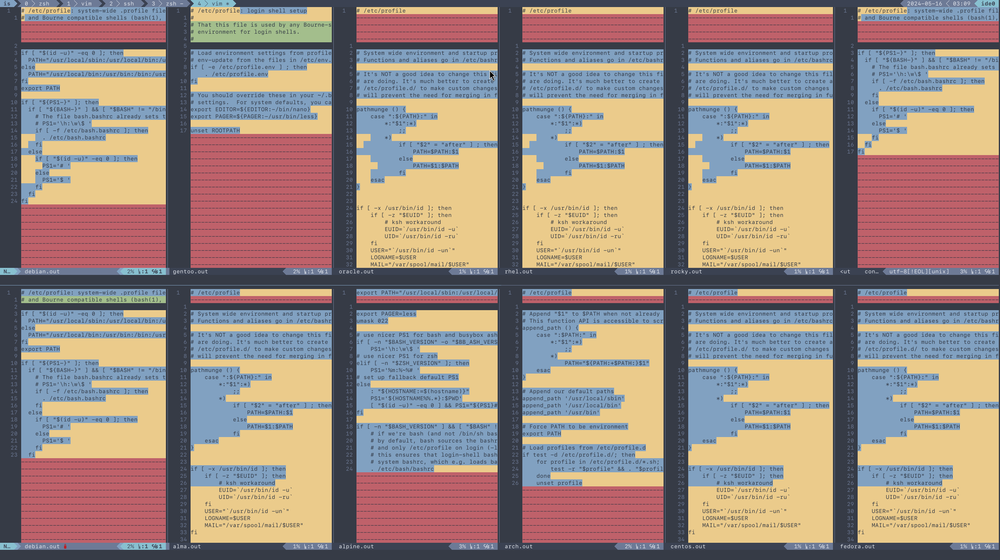
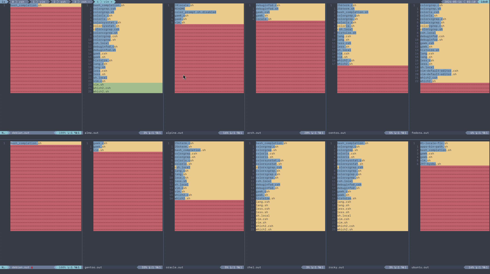
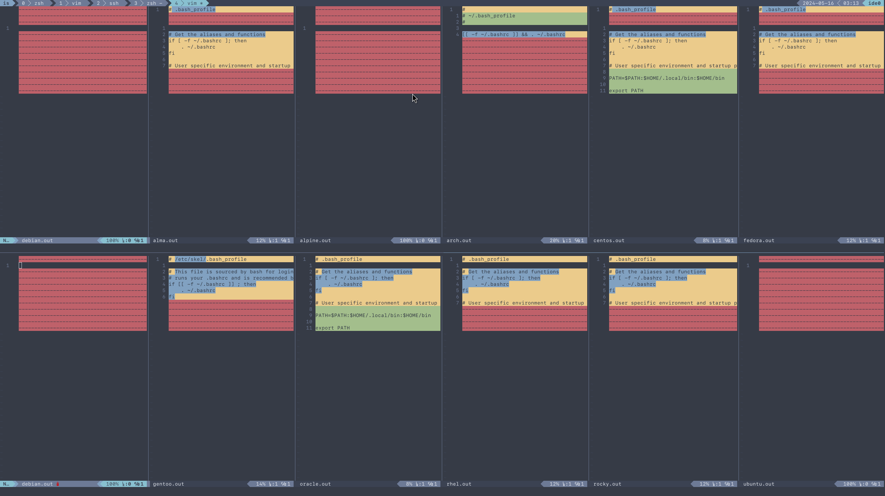
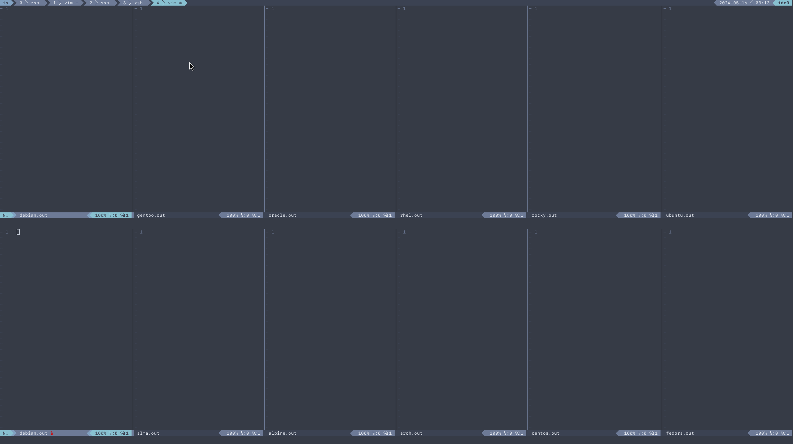
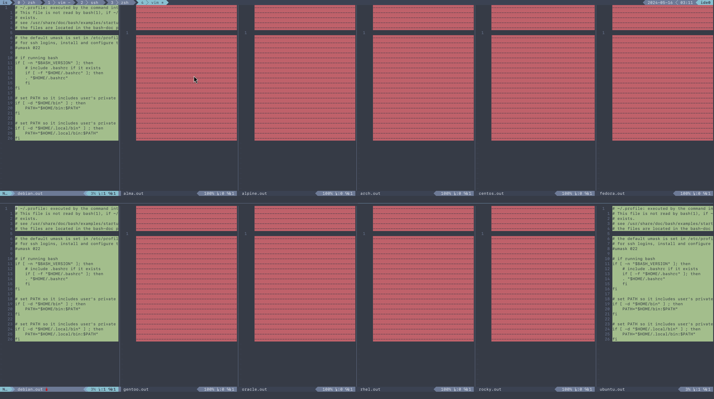

# Environments and other shell behaviors


Your environments come from your shell.
First, let's look into what your default shell is.

```
λ ./tests/default_shell.sh
alma.out -> /bin/bash
alpine.out -> /bin/bash
arch.out -> /usr/bin/bash
centos.out -> /bin/bash
debian.out -> /bin/bash
fedora.out -> /bin/bash
gentoo.out -> /bin/bash
oracle.out -> /bin/bash
rhel.out -> /bin/bash
rocky.out -> /bin/bash
ubuntu.out -> /bin/bash
```

It appears that they're all bash, which makes our lives easier.

To quote from the [manpage](https://linux.die.net/man/1/bash)

> When bash is invoked as an interactive login shell, or as a non-interactive
> shell with the --login option, it first reads and executes commands from the
> file /etc/profile, if that file exists. After reading that file, it looks for
> ~/.bash_profile, ~/.bash_login, and ~/.profile, in that order, and reads and
> executes commands from the first one that exists and is readable. The
> --noprofile option may be used when the shell is started to inhibit this
> behavior.

You can use your favorite diff tool to inspect the differences in all of these
files from the out directory. Our test covers `.bash_profile`, `.bash_login`,
`.profile`, `/etc/profile`, and `/etc/profile.d/`.

`/etc/profile`

`/etc/profile.d`

`.bash_profile`

`.bash_login`

`.profile`

