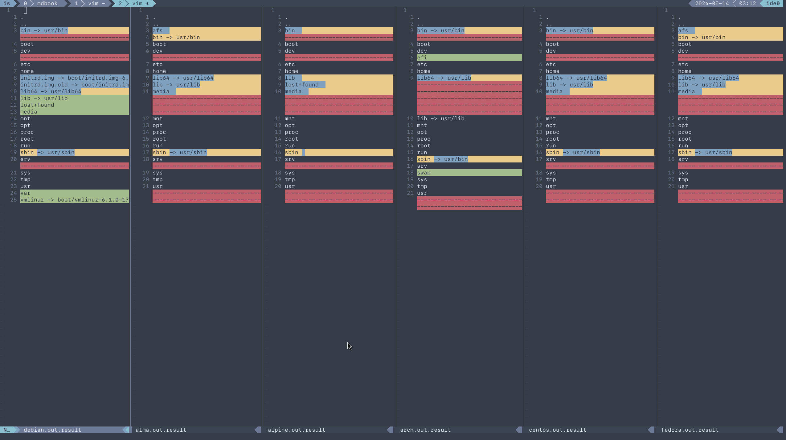
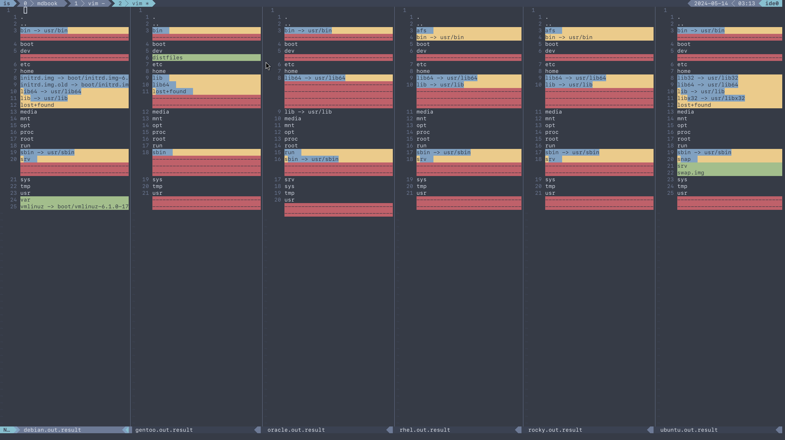

# Root FS
`./tests/root.sh` outputs result files to out/root

Then, use your favorite diff tool to visually inspect the differences.

```
vim -d debian.out.result alma.out.result  alpine.out.result  arch.out.result  centos.out.result fedora.out.result
vim -d debian.out.result gentoo.out.result  oracle.out.result  rhel.out.result  rocky.out.result  ubuntu.out.result
```



