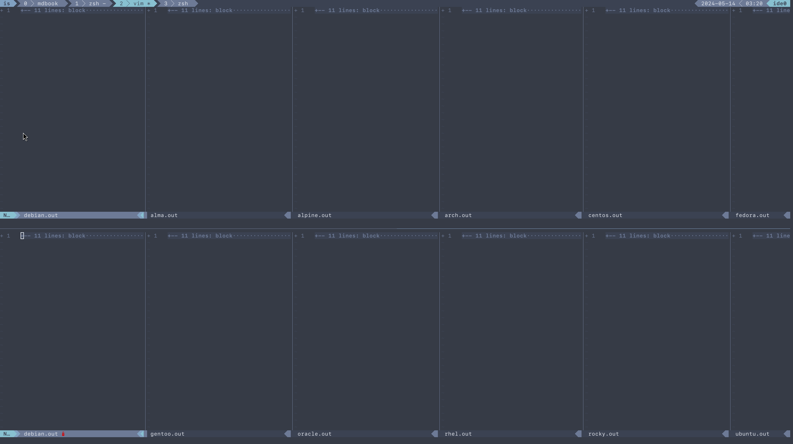

# Sys FS

Simply use your favorite diff tool to look at all the .out files at out/sysfs

```
vim -d debian.out gentoo.out oracle.out rhel.out rocky.out ubuntu.out
vim -d debian.out alma.out alpine.out arch.out centos.out fedora.out
```

